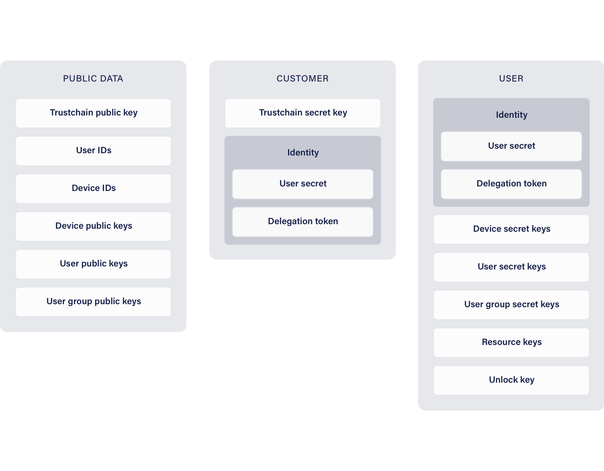

# Concepts

The *Tanker SDK* provides security based on the principle of separation of knowledge between the *Tanker server*, the *user* and the *application server*.
To establish trust between these actors and to enable sharing of encrypted *data* between *user*s, the *Tanker SDK* produces and uses cryptographic keys, IDs, and tokens.
The following section describes these elements, how they are generated, used, and, when applicable, stored.
It should be noted that they are only valid within a single *Trustchain*.

## Summary

| Abbreviation | Description                   |
| ------------ | ----------------------------- |
| DEK          | Device Encryption Key Pair    |
| DID          | Device ID                     |
| DSK          | Device Signature Key Pair     |
| GEK          | Group Encryption Key Pair     |
| GSK          | Group Signature Key Pair      |
| LES          | Local Encrypted Storage       |
| REK          | Resource Encryption Key       |
| SEK          | Shared Encrypted Key          |
| TSK          | Trustchain Signature Key Pair |
| UEK          | User Encryption Key Pair      |
| UID          | User ID                       |
| ULK          | Unlock Key                    |
| US           | User Secret                   |
| SPerID       | Secret Permanent Identity     |
| PPerID       | Public Permanent Identity     |
| SProID       | Secret Provisional Identity   |
| PProID       | Public Provisional Identity   |

*[UID]: User ID
*[US]: User Secret
*[SPerID]: Secret Permanent Identity
*[PPerID]: Public Permanent Identity
*[SProID]: Secret Provisional Identity
*[PProID]: Public Provisional Identity
*[DID]: Device ID
*[ULK]: Unlock Key
*[LES]: Local Encrypted Storage
*[TSK]: Trustchain Signature Key Pair
*[DEK]: Device Encryption Key Pair
*[DSK]: Device Signature Key Pair
*[UEK]: User Encryption Key Pair
*[GEK]: Group Encryption Key Pair
*[GSK]: Group Signature Key Pair
*[REK]: Resource Encryption Key
*[SEK]: Shared Encrypted Key
*[SEKs]: Shared Encrypted Keys

## Trustchain keys

A *Trustchain* is identified by a unique ID, a name, and a signature key pair (TSK).
The name is informative and is never used in the SDK.
The public part of the TSK is included in the *Trustchain*'s root *block*.
The *Trustchain* ID is actually the hash of the *Trustchain* root *block*.

The TSK is generated client-side by the *customer* using the [Tanker dashboard](https://dashboard.tanker.io) during the *Trustchain* creation.
As such, it is only known by the *customer* and cannot be recovered by *Tanker* in any way.

## User ID

The *User ID* (UID) identifies a *user* on the *Trustchain*.
It is provided by the *application* when the *user* is created, and is part of the user's *Secret Identity* (SPerID).
The *Tanker SDK* cryptographically hashes *User ID*s locally before sending them to the *Tanker server*.

## User secret

The user secret (US) is a symmetric key, randomly generated by the *application server* for each *user*.
It is part of the SPerID, and is considered an implementation detail not exposed in the Tanker API.
The user secret cannot be changed once the first *user*'s *device* has been created.
It is used to encrypt and decrypt the LES and the ULK stored by the *unlock service*.

## Delegation token

A delegation token is proof of the *user*'s authentication with the *application server*. It is generated when the *user* opens their first session in the *Tanker SDK*.
The delegation token is composed of an ephemeral signature key pair, a delegation signature, and the [UID](#user-id).
The delegation signature is created by combining the ephemeral public key and the [UID](#user-id), then signing the result with the private [TSK](#trustchain-keys).
The delegation token is only used when the *user* creates their first *device* on the *Trustchain*, to sign the first `device_creation` *block* of that *user*.

## Secret Permanent Identity

The secret permanent identity (SPerID) is generated and stored by the *application* and provided to a user only after successful authentication against the *application server*.
It should never be shared with other *user*s.
It contains some secret key material such as the [US](#user-secret) and [delegation token](#delegation-token).
It represents the identity of the *user* for the *Tanker SDK* and is considered a proof of authentication against the *application server*.

## Public Permanent Identity

A public permanent identity (PPerID) can be generated from a [SPerID](#secret-permanent-identity), and is used to uniquely identify a *user*.
It contains a [UID](#user-id), but no secret key material and it is safe to share publicly.

## Device ID

Each *user* must have at least one *device*. *Device*s are identified in the *Tanker SDK* by a randomly attributed *device* ID (DID). Each *device* has a local clear storage (LCS) and a local encrypted storage (LES).

## Device keys

Each *device* registered on the *Trustchain* has one encryption key pair (DEK) and one signature key pair (DSK).
Device keys are stored in the *device*'s [LES](#device-id). They are never replaced or modified after creation.
The public DEK and DSK are pushed to the *Trustchain* in the `device_creation` *block*.
The private DEK and DSK never leave the *device*.

## User keys

Every *user* registered on the *Trustchain* has one active encryption key pair (UEK).
User keys are stored in each *device*'s [LES](#device-id).
The private UEK is encrypted with each of the *user*'s *device*s' public [DEK](#device-keys) before being pushed to the *Trustchain*.
It is pushed to the *Trustchain* in the `device_creation` *block* and updated whenever a *device* is revoked.

## User group keys

A *user group* has one encryption key pair (GEK) and one signature key pair (GSK).
*User group* keys are stored in the *device*'s [LES](#device-id).
The private GSK is encrypted with the private GEK, which is encrypted with each *group member*'s [UEK](#user-keys).
They are pushed to the *Trustchain* in the `user_group_creation` *block* and updated whenever a *group member* is removed from a *user group*.

## Resource keys

A new resource key (REK) is randomly generated each time a *user* encrypts *data*.
The *data* is symmetrically encrypted with the REK.
The REK can be encrypted for *user*s or *user group*s.
When sharing a resource key with a *user*, the REK is encrypted using the [UEK](#user-keys) of that *user* creating a shared encryption key (SEK).
When sharing a resource key with a *user group*, the REK is encrypted using the [GEK](#user-group-keys) of that *user group* creating a shared encryption key (SEK).
SEKs are pushed to the *Trustchain* in `key_publish` *block*s.
When received by a *device*, SEKs are stored in the [LES](#device-id).

## Unlock key

Once a session has been opened for the first time, it is highly advised to generate an unlock key (ULK) to be able to register new *device*s.
When generating an unlock key, an *unlock device* is created and pushed to the *Trustchain*.
The created [DEK](#device-keys) and [DSK](#device-keys) are not saved in the [LES](#device-id) but serialized in an opaque token: the unlock key (ULK).

## Secret Provisional Identity

A secret provisional identity (SProID) represents the identity of a user that is not yet registered on Tanker. It is split into two halves that are stored on the *application server* and on *Tanker server*s.
A provisional identity is attached to some authentication methods. For the moment only email is supported.
Each half contains the name of the authentication method, a value (in case of email, the value is the email address), and encryption and signature key pairs.

## Public Provisional Identity

A public provisional identity (PProID) can be generated from a [SProID](#secret-provisional-identity) and consists of the [SProID](#secret-provisional-identity) without its secrets parts.

