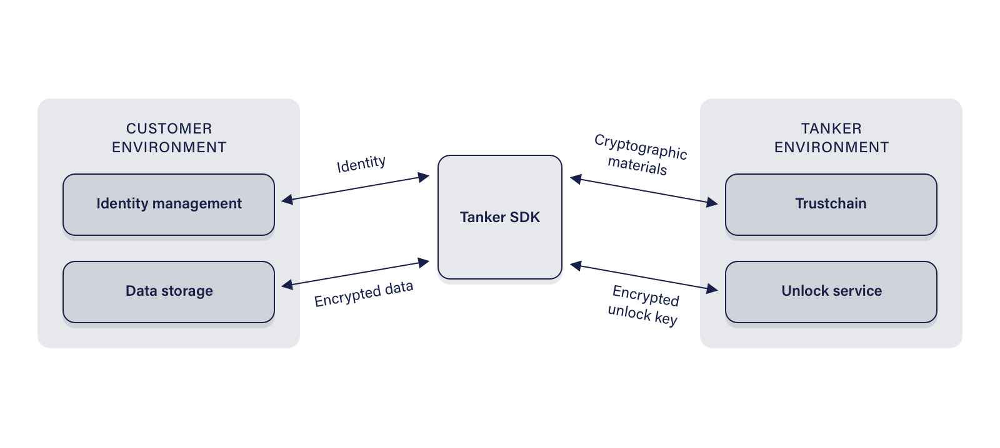

# Overview

*Tanker* is a solution for implementing client-side encryption in *application*s. It makes use of end-to-end encryption, and, in case of *device* loss, it provides an optional way for developers to ensure their *user*s can recover their cryptographic identities. This mechanism is referred to as *identity verification service* and depends on both the *application server* and a third-party verification server to protect and redistribute *user*s' cryptographic identities.

For this to work, a **Tanker app** needs to be created on the [Tanker Dashboard](https://dashboard.tanker.io), and then *Tanker Core* must be used to implement the Tanker solution into the app.

## Design considerations

Special care has been taken to ensure that, from an end-user standpoint, *Tanker* integrates seamlessly in *application*s, despite the challenges involved in doing end-to-end encryption. For developers, we made sure that the *Tanker Core* solution is easy-to-use and intuitive, despite the complexity under the hood.

The following considerations were made when designing the solution:

- The encryption schemes must be end-to-end
- Cryptographic materials must be tamper-proof
- The integrity of cryptographic materials delivered by the *Trustchain* is checked client-side; it is not required to trust the Trustchain server
- All pieces of *data* given to *Tanker* must be encrypted with a different key
- The optional *identity verification service* must not be able to access *user*s' *data*
- *Group* and *user* keys are rotated when appropriate to support revocation of *user*s and *device*s

## Tanker Core

*Tanker Core* integrates in your *application* and runs where your *application* runs. It is available in Javascript, Java, Objective-C, C, and Python.

It has 3 main functionalities:

- It manages the client's cryptographic identity
- It fetches and verifies Trustchain *block*s to know the cryptographic identities of recipients
- It encrypts and decrypts *data* on-device

### Cryptographic Library Used

We use the Sodium cryptographic library for all our cryptographic needs. We have chosen this library for several reasons:

- It is open-source
- It is well documented
- Its code is well written
- It has a relatively small binary size
- Its algorithms are standard and cover all our needs
- It supports web browsers through [Emscripten](https://emscripten.org)

### Random generator

We use the random generator provided by the Sodium library. The library uses the best implementation available for the platform it runs on:

- Linux's `getrandom()`
- Windows' `RtlGenRandom()`
- WebCrypto's `getRandomValues()` for all web browsers
- Node.js' `crypto.randomBytes()`

### Symmetric Encryption

*Tanker Core* uses *libsodium*’s `crypto_aead_xchacha20poly1305_ietf()`.
As its name suggests, it uses the XChaCha20 algorithm with a 256-bits key size, a 192-bits nonce, and a 128-bits MAC size.

### Asymmetric Encryption

*Tanker Core* uses *libsodium*'s `crypto_box` functions.
These functions use *X25519*, which is an *ECDH* algorithm over *Curve25519*. It also uses *XSalsa20* and *Poly1305* for symmetric encryption.

### Data Signature

*Tanker Core* uses *libsodium*'s `crypto_sign` functions with *Ed25519* keys.

### Data and Password Hashing

For general-purpose hashing, *Tanker Core* uses *libsodium*'s `crypto_generichash` function, which uses the *BLAKE2b* hash algorithm.
When *Tanker* needs to hash passwords to store them, it first hashes them on *device* as described above, then hashes them again server-side using the *Argon2* function provided by Golang's `x/crypto`. Subsequently, they are salted with a 32-bits randomly generated salt. *Tanker*'s *Argon2id* parameters are 2 passes on a maximum of 1 thread with a minimum of 32MB memory usage.

### Secure communication layer

All communications between actors are done through HTTPS.
We use the [LibreSSL](http://www.libressl.org/) implementation on mobile and defer to the user-agent for web browsers and Node.js.
Server certificates are verified on all platforms even if, in some cases, we cannot use the ones provided by the platform.
In such occurrences, *Tanker Core* comes with the certificates embedded in its binary code.

