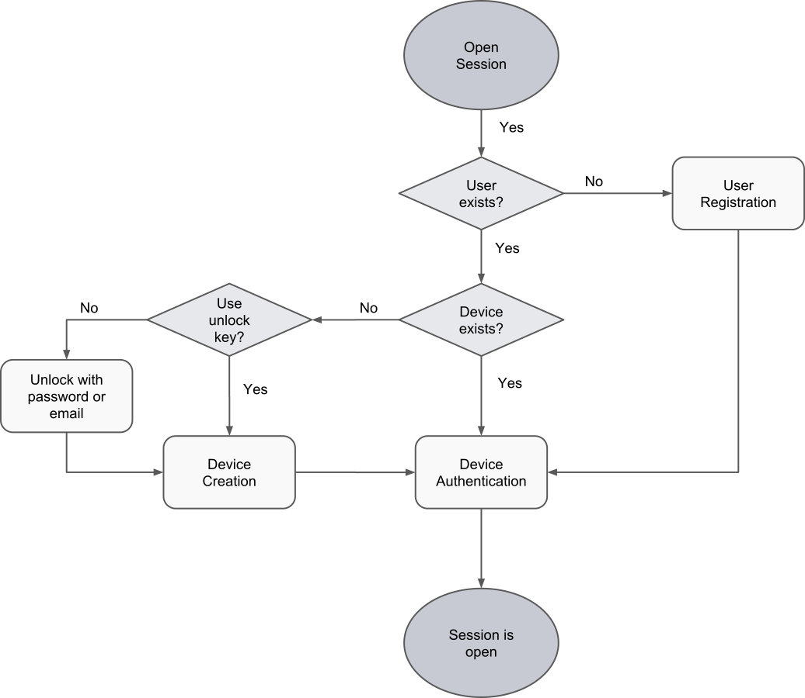

<!-- note: duplicated from concepts.md for now -->
[Device Encryption Key Pair]: concepts.md#device-keys "Unique identifier of a user"
[Device ID]: concepts.md#device-id "Unique identifier of a device belonging to a user"
[Device Signature Key Pair]: concepts.md#device-keys "Used when the user signs a block"
[Group Encryption Key Pair]: concepts.md#user-group-keys "Used when sharing data securely within a group"
[Group Signature Key Pair]: concepts.md#user-group-keys "Used when the user modifies a group"
[Local Encrypted Storage]: concepts.md#device-id "A place where key materials are stored, encrypted at rest while the Tanker session is closed"
[Local Clear Storage]: concepts.md#device-id "A place where key materials are stored after they are decrypted while the Tanker session is open"
[Resource Encryption Key]: concepts.md#resource-keys "A symmetric key that can be exchanged securely across users"
[Shared Encrypted Key]: concepts.md#resource-keys "The result of encrypting a Resource Encryption Key for a recipient"
[Trustchain Signature Key Pair]: concepts.md#trustchain-keys "Root of the Trustchain - used to sign user additions"
[User Encryption Key Pair]: concepts.md#user-keys "Used for sharing encrypted keys across users"
[User ID]: concepts.md#user-id "Unique identifier of a user"
[Verification Key]: concepts.md#verification-key "An opaque token that allows creating new devices"
[User Secret]: concepts.md#user-secret "A secret generated and stored on the application server that protects the local encrypted storage"
[Secret Permanent Identity]: concepts.md#secret-permanent-identity "An opaque string containing private data about user's identity"
[Public Permanent Identity]: concepts.md#public-permanent-identify "Generated from a Secret Permanent Identity - essentialy equivalent to a user ID"
[Secret Provisional Identity]: concepts.md#secret-provisional-identity "Same as Secret Permanent Identity, but for a user not registered on the Trustchain yet"
[Public Provisional Identity]: concepts.md#public-provisional-identity "Same as Public Permanent Identity, but for a user not registered on the Trustchain yet"

# Protocol

The following chapter describes how the previously defined [concepts](#concepts) are used in Tanker.

The protocols have been split in 3 sections for ease of reading:

- The [cryptographic identity management](#cryptographic-identity-management) section describes how the *Tanker Core* SDK ensures that a *user*'s cryptographic identity is available on every *device*, and how the optional *identity verification service* prevents a *user* from losing their cryptographic identity
- The [encryption](#encryption) section describes how *resource*s are encrypted and shared with *user*s
- The [group encryption](#group-encryption) section describes how *user group*s are managed and how to share encrypted *resource*s with them

## Cryptographic identity management

The following diagram describes how the different protocols interact together when opening a *Tanker* session.

Please note that when the user handles the [Verification Key] themselves (without using the *identity verification service*), the system is fully end-to-end.

### Session management

#### Signing up

The first time the user signs up on a given device, the *Tanker Core* SDK generates *two* [Device Encryption Key Pair]s and two [Device Signature Key Pair]s, one for the *ghost device*, and one for the *physical device*. The ghost device pairs are not saved in the [Local Encrypted Storage] but serialized in an opaque token; the [Verification Key].

Then, the user must choose one *verification method*: email, passphrase, or verification key.

What happens next depends on the chosen method:

* By email: a verification code is sent to the email address
* By passphrase: the application should ask the user to enter a passphrase
* By verification key: the application displays the Verification key and asks the user to keep it somewhere safe.

The public keys of the ghost device and the physical device are pushed in two blocks to the Trustchain.

If the user chose 'email' or 'passphrase' as the verification method, the [Verification Key] is encrypted on the *device* with the [User Secret] and sent to the *Tanker server*.

#### Signing in

The first time the user signs in on a new device, their identity must be *verified* using the method selected during sign up.

* By passphrase: the *user* must provide their passphrase to the *Tanker Core* SDK. It is hashed client-side, then sent to the *Tanker server* to fetch the encrypted [Verification Key].
* By email: the *user* triggers a verification request through to the *application server* which in turn calls the *Tanker server*. The *Tanker server* then sends an email containing the *Tanker verification code* that must be provided to the *Tanker Core* SDK.
* By verification key: the *user* directly gives their verification key to the *Tanker Core SDK*.

When using the 'passphrase', or 'email' verification methods, the *user* still needs to authenticate against the *application server* to obtain their [User Secret] to decrypt the [Verification Key].

### User registration

Prerequisite: the *user* is registered on the *application server*, but not on the *Trustchain*.
Once the *user* is authenticated, the *application* can fetch the *user*'s [Secret Permanent Identity] from the *application server*.

The *Tanker Core* SDK extracts the [User Secret] and the [User ID] from the [Secret Permanent Identity], and use them to create the *device*'s [Local Encrypted Storage]. Next, the *Tanker Core* SDK creates the [Device Encryption Key Pair], [Device Signature Key Pair], and [User Encryption Key Pair], and stores them to the [Local Encrypted Storage].

A `device_creation` *block* is then constructed with these keys, and signed with the ephemeral private key of the [delegation token](#delegation-token) found in the [Secret Permanent Identity] retrieved earlier. The *block* is pushed to the *Trustchain* and verified by the *Tanker server*.

Assuming the pushed *block* is correct, the *Tanker server* acknowledges it, allowing the *device* to [authenticate itself](#device-authentication).

### Device authentication

Prerequisite: the *device* is already registered on the *Trustchain*, the [Secret Permanent Identity] has been retrieved from the *application server* after the *user* has been authenticated against the *application server*.

The *Tanker Core* SDK uses the [User Secret] retrieved from the [Secret Permanent Identity] to access the [Device Encryption Key Pair] and [Device Signature Key Pair] stored in the [Local Encrypted Storage].

When the *user* opens their *Tanker* session, the *device* opens an HTTPS WebSocket connection with the *Tanker server*.
Once the connection is established, the *device* asks for an authentication challenge.

This challenge is an array of bytes made of:

- a fixed prefix shared between the *Tanker server* and all *Tanker Core* SDK implementations
- a random part

The *device* then sends the authentication message containing:

- the signature of the challenge with the private [Device Signature Key Pair]
- the [User ID]
- the `Trustchain ID`
- the public [Device Signature Key Pair], acting as a unique identifier for the *device*

This allows the *Tanker server* to check that:

- the *device* is registered on the *Trustchain*
- the *device* is correctly associated with the provided [User ID]
- the signature matches the challenge

If any of these check fail, the connection is closed.

### Device registration

Prerequisite: the *user* has created a [Verification Key].

Except for the first *device*, which is validated in a specific way previously described, additional *device*s must be validated by an already registered *device*. In practice, these *device*s are validated by the *ghost device*.

Given the *user*'s [Verification Key], the steps to register a new *device* are as follows:

1. Extract the *ghost device*'s [Device Encryption Key Pair] and [Device Signature Key Pair] from the [Verification Key]
2. Pull the *Trustchain* up to the *ghost device*'s `device_creation` *block*, verify it and extract the [User Encryption Key Pair] from it
3. Decrypt the [User Encryption Key Pair] using the  *ghost device*'s private [Device Encryption Key Pair]
4. Generate the new *device*'s [Device Encryption Key Pair] and [Device Signature Key Pair]
5. Construct the new *device*'s `device_creation` *block* and sign it with the *ghost device*'s private [Device Signature Key Pair]
6. Push the *block* to the *Trustchain*
7. The *Tanker server* validates the *block*
8. The new *device* authenticates against the *Tanker server*

## Encryption

### Data encryption and decryption

Prerequisite: the *user*'s *device* is authenticated against the *Tanker server*.

Encrypting *data* implies automatically sharing the [Resource Encryption Key] with the user themselves so that their other devices can decrypt the data. The steps to encrypt a resource are as follows:

1. The *application* calls `tanker.encrypt`
2. The *Tanker Core* SDK generates the [Resource Encryption Key]
3. The *Tanker Core* SDK symmetrically encrypts the given *data* with the [Resource Encryption Key]
4. The *Tanker Core* SDK shares the [Resource Encryption Key] with the recipients as described in [Sharing with users](#sharing-with-users) and [Sharing with user groups](#sharing-with-user-groups)

### Sharing with users

Prerequisite: the *user*'s *device* is authenticated against the *Tanker server*, and some *data* has been encrypted.

Given the [Resource Encryption Key], sharing encrypted *data* with another *user* is done as follows:

1. The *application* fetches the [Public Permanent Identity] for the recipient from the *application server*
2. The *application* calls `tanker.share` with the [Public Permanent Identity]
3. The *Tanker Core* SDK fetches the recipient's `device_creation` *block*s from the *Trustchain*
4. The *Tanker Core* SDK verifies them and extract the recipient's public [User Encryption Key Pair]
5. The *Tanker Core* SDK asymmetrically encrypts the [Resource Encryption Key] with the public [User Encryption Key Pair], creating the [Shared Encrypted Key]
6. The *Tanker Core* SDK creates a `key_publish` *block* containing the [Shared Encrypted Key] and the recipient's public [User Encryption Key Pair], and pushes it to the *Trustchain*
7. The *Tanker server* validates the *block* and notifies all the recipients' *device*s
8. The recipient's *device* retrieves the *block*, verifies it and decrypts the [Shared Encrypted Key] using the private [User Encryption Key Pair], obtaining the [Resource Encryption Key]
9. The *application* calls `tanker.decrypt` on the recipient's *device*
10. The *Tanker Core* SDK decrypts the data using the [Resource Encryption Key]

## Group encryption
### User group creation

Prerequisite: the *user*'s *device* is authenticated against the *Tanker server*.

The steps to create a new *user group* are as follows:

1. The *application* fetches the [Public Permanent Identity] for each future *group member*
2. The *application* calls `tanker.createGroup` with the obtained [Public Permanent Identity]s
3. The *Tanker Core* SDK fetches all future *group member*s' `device_creation` *block*s from the *Trustchain*
4. The *Tanker Core* SDK verifies them and extracts their public [User Encryption Key Pair]
5. The *Tanker Core* SDK generates the [Group Encryption Key Pair] and the [Group Signature Key Pair]
6. The *Tanker Core* SDK encrypts the private [Group Signature Key Pair] with the public [Group Encryption Key Pair]
7. The *Tanker Core* SDK encrypts the private [Group Encryption Key Pair] with each future *group member*'s public [User Encryption Key Pair]
8. Using the private [Group Signature Key Pair], the *Tanker Core* SDK signs the public and encrypted private [Group Encryption Key Pair] and [Group Signature Key Pair]
9. The *Tanker Core* SDK creates a `user_group_creation` *block* with all of the above and pushes it to the *Trustchain*
10. The *Tanker server* validates the *block* and sends the update to all *group member*s' *device*s
11. Each *group member*s' *device* retrieves the *block*, verifies it and decrypts the [Group Encryption Key Pair] and [Group Signature Key Pair] using their private [User Encryption Key Pair]

### Sharing with user groups

Prerequisite: the *user*'s *device* is authenticated against the *Tanker server*, and some *data* has been encrypted.

Sharing with a *user group* is pretty much the same as sharing with a *user* but requires using a [GID](#group-id) returned by `tanker.createGroup`.
The steps are as follows:

1. The *application* calls `tanker.share` with the [GID](#group-id) to share with
2. The *Tanker Core* SDK fetches the recipient *group*'s public [Group Encryption Key Pair] from the *Trustchain*, if not already present in the [Local Encrypted Storage]
3. The *Tanker Core* SDK encrypts the [Resource Encryption Key] with the public [Group Encryption Key Pair]. The result is the [Shared Encrypted Key] for this particular *user group* and *resource*
4. The *Tanker Core* SDK creates a *block* containing the [Shared Encrypted Key] and the recipient public [Group Encryption Key Pair]
5. The *Tanker Core* SDK pushes the *block* to the *Trustchain*
6. The *Tanker server* validates the *block* and notifies all the recipients' *device*s
8. The recipients' *device*s retrieve the *block*, verify it and decrypt the [Shared Encrypted Key] using the private [Group Encryption Key Pair], obtaining the [Resource Encryption Key]
7. The *application* calls `tanker.decrypt` on one of the recipient group's *device*s
10. The *Tanker Core* SDK decrypts the data using the [Resource Encryption Key]

## Preregistration
### Provisional identity creation

*Tanker* supports sharing with users that are not yet registered.
The only currently supported authentication method for these identities is email.

The ownership of a provisional identity is split between *Tanker* and the *application server*.
When the *user* wants to claim the provisional identity, they will authenticate with an email against both the *application server* and against *Tanker* so that they get both halves of the [Secret Provisional Identity].

### Sharing with a provisional identity

Prerequisite: the *user*'s *device* is authenticated against the *Tanker server*, some *data* has been encrypted

1. The *application* requests a public identity for a user's email which is not registered yet
2. The *application server* generates a [Public Provisional Identity] and sends it back to the *application*
3. The *application* calls `tanker.share` with the *application* [Public Provisional Identity]
4. The *Tanker Core* SDK requests a [Public Provisional Identity] for the user from the *Tanker server*
5. The *Tanker server* generates a [Public Provisional Identity]
6. The *Tanker Core* SDK asymmetrically encrypts the [Resource Encryption Key] with the *application* [Public Provisional Identity]'s encryption key
7. The *Tanker Core* SDK asymmetrically encrypts the previous result with the *Tanker* [Public Provisional Identity]'s encryption key to get the [Shared Encrypted Key]
8. The *Tanker Core* SDK creates a `key_publish` *block* containing the [Shared Encrypted Key] and both of the recipient's [Public Provisional Identity]s' public signature keys, and pushes it to the *Trustchain*
9. The *Tanker server* validates and holds the block until it is claimed

### Creating a group with a provisional user

Prerequisite: the *user*'s *device* is authenticated against the *Tanker server*.

1. The *application* requests a public identity for a user's email which is not registered yet
2. The *application server* generates the [Public Provisional Identity] for the future *group member*
3. The *application* calls `tanker.createGroup` with the obtained [Public Provisional Identity]
4. The *Tanker Core* SDK requests a [Public Provisional Identity] for the user from the *Tanker server*
5. The *Tanker server* generates a [Public Provisional Identity]
6. The *Tanker Core* SDK generates the [Group Encryption Key Pair] and the [Group Signature Key Pair]
7. The *Tanker Core* SDK encrypts the private [Group Signature Key Pair] with the public [Group Encryption Key Pair]
8. The *Tanker Core* SDK encrypts the private [Group Encryption Key Pair] with the *application* [Public Provisional Identity]'s encryption key
9. The *Tanker Core* SDK encrypts the result of the previous step with the *Tanker* [Public Provisional Identity]'s encryption key
10. Using the private [Group Signature Key Pair], the *Tanker Core* SDK signs the public and encrypted private [Group Encryption Key Pair] and [Group Signature Key Pair]
11. The *Tanker Core* SDK creates a `user_group_creation` *block* with all of the above and pushes it to the *Trustchain*
12. The *Tanker server* validates and holds the block until it is claimed

### Claiming a provisional identity

Prerequisite: the *user*'s *device* is authenticated against the *Tanker server* and some *users* have shared *data* with a provisional identity owned by them or added it to a group.

1. The *application server* sends an email to the *user* with a verification code
2. The *device* gets the *application* [Secret Provisional Identity] using the verification code
3. The *Tanker server* sends an email to the *user* with a verification code
4. The *Tanker Core* SDK gets the *Tanker* [Secret Provisional Identity] using the verification code
5. The *Tanker Core* SDK encrypts both [Secret Provisional Identity]s' private encryption keys with the [User Encryption Key Pair]
6. The *Tanker Core* SDK signs its [Device ID] with the *application* [Secret Provisional Identity]'s private signature key
7. The *Tanker Core* SDK signs its [Device ID] with the *Tanker* [Secret Provisional Identity]'s private signature key
8. The *Tanker Core* SDK creates a block with both [Secret Provisional Identity]s' public signature keys, the aforementioned signatures, and the encrypted [Secret Provisional Identity] keys and pushes it to the *Trustchain*
9. The *Tanker server* validates the block and stores it
10. The *Tanker server* publishes all the `key_publish` and *group* blocks related to the claimed provisional identity to the *device*
11. The *Tanker Core* SDK decrypts the [Shared Encrypted Key]s with both [Secret Provisional Identity]s' private encryption keys when needed
12. The *Tanker Core* SDK decrypts the [Group Encryption Key Pair]s with both [Secret Provisional Identity]s' private encryption keys when needed
