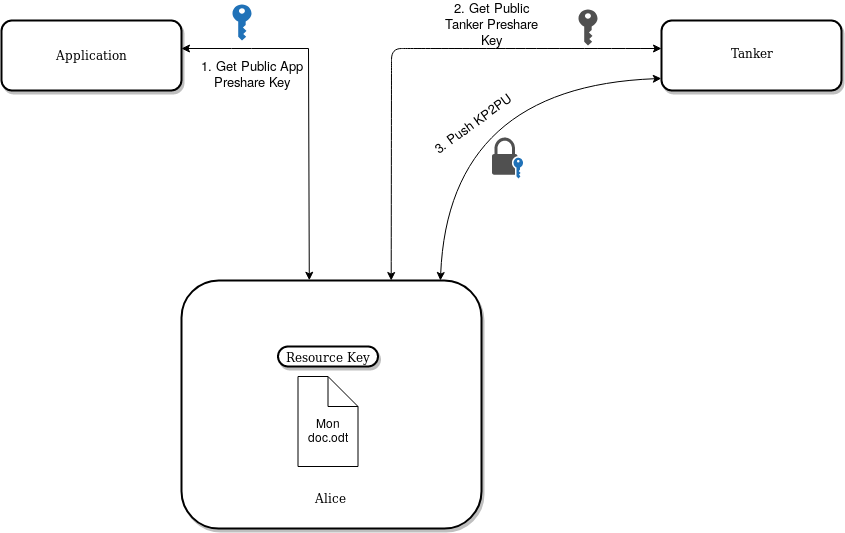

<!-- note: duplicated from concepts.md for now -->
[Tanker App]: concepts.md#tanker-app "An application created in the Tanker dashboard"
[Trustchain]: concepts.md#trustchain "A Trustchain is a collection of signed blocks, attached to a given app"
[Device Encryption Key Pair]: concepts.md#device-keys "Used to encrypt the user keys"
[Device ID]: concepts.md#device-id "Unique identifier of a device belonging to a user"
[Device Signature Key Pair]: concepts.md#device-keys "Used when the user signs a block"
[Delegation Token]: concepts.md#delegation-token "Part of a Secret Permanent Identity. Combination of an ephemeral private key and the user ID and the signature of them both"
[Group Encryption Key Pair]: concepts.md#user-group-keys "Used when sharing data securely within a group"
[Group Signature Key Pair]: concepts.md#user-group-keys "Used when the user modifies a group"
[Local Encrypted Storage]: concepts.md#device-id "A place where key materials are stored, encrypted at rest while the Tanker session is closed"
[Resource Encryption Key]: concepts.md#resource-keys "A symmetric key that can be exchanged securely across users"
[Shared Encrypted Key]: concepts.md#resource-keys "The result of encrypting a Resource Encryption Key for a recipient"
[Trustchain Signature Key Pair]: concepts.md#trustchain-keys "Root of the Trustchain - used to sign user additions"
[User Encryption Key Pair]: concepts.md#user-keys "Used for sharing encrypted keys across users"
[User ID]: concepts.md#user-id "Unique identifier of a user"
[Verification Key]: concepts.md#verification-key "An opaque token that allows creating new devices"
[User Secret]: concepts.md#user-secret "A secret generated and stored on the application server that protects the local encrypted storage"
[Secret Permanent Identity]: concepts.md#secret-permanent-identity "An opaque string containing private data about user's identity"
[Public Permanent Identity]: concepts.md#public-permanent-identity "Generated from a Secret Permanent Identity - essentialy equivalent to a user ID"
[Secret Provisional Identity]: concepts.md#secret-provisional-identity "Same as Secret Permanent Identity, but for a user not registered on the Trustchain yet"
[Public Provisional Identity]: concepts.md#public-provisional-identity "Same as Public Permanent Identity, but for a user not registered on the Trustchain yet"
[TLS]: concepts.md#transport-layer-security "Tanker Core and server uses the TLS protocol to communicate across the Internet, preventing eavesdropping and tampering"
[Resource ID]: concepts.md#resource-id "The unique ID part of an encrypted data"
[Verification Method]: concepts.md#Verification-method "A verification method allows a user to retrieve their encrypted verification key"

# Protocol

The following chapters describe how the previously defined [concepts](#concepts) are used in Tanker.

The protocols have been split in 4 sections for ease of reading:

- The [session management](#session-management) section describes how *Tanker Core* ensures that a *user*'s cryptographic identity is available on every *device*, and how the optional *identity verification service* prevents a *user* from losing their cryptographic identity
- The [verification methods](#verification-methods) section describes how different methods are available to the user to retrieve it's cryptographic identity using the *Tanker Identity* service.
- The [encryption and decryption](#encryption-and-decryption) section describes how *resource*s are encrypted, decrypted, and shared with *user*s
- The [preregistration](#preregistration) section describes how a registered user can shared a resource to a non yet registered user.

## Communications

Every communication and information exchanges between *Tanker Core* and the *Tanker Server* are done through [TLS] connection. In the same way, exchanges between *Tanker Core* and the *application server* also use [TLS], in particular for Tanker Identity retrievals.

## Session management

### Cryptographic identity management

The following diagram describes how the different protocols interact together when opening a *Tanker* session.

Please note that when the user handles the [Verification Key] themselves (without using the *identity verification service*), the system is fully end-to-end.

Before being able to encrypt/decrypt and exchange keys, a *user* must exist on the *Trustchain*. This means they have at least one valid *device* (not revoked) registered on *Trustchain*. To register on the *Trustchain*, the *Tanker server* asks for the *user*'s proof of authentication against the *application server*. The *application server* must be able to generate a [Secret Permanent Identity] and deliver it to the *application* securely.

One of the first action taken by *Tanker Core* is to ask the *Tanker server* for the user's existence on the *Trustchain* and if so, if the current *device* exists. The result of this request will either initiate a [user registration](#user-registration), a [device registration](#device-registration), or the required follow-up to a [device authentication](#device-authentication).

If no [Local Encrypted Storage] is found, *Tanker Core* will create one automatically. *Tanker Core* extracts the [User Secret] and the [User ID] from the [Secret Permanent Identity], and use them to create the *device*'s [Local Encrypted Storage].

### User Registration

Prerequisite: The *user* is registered on the *application*, but not on the *Trustchain*.
Once the *user* is authenticated, the *application* can fetch the *user*'s [Secret Permanent Identity] from the *application server*.

*Tanker Core* creates a [User Encryption Key Pair].

*Tanker Core* creates a [Device Encryption Key Pair] and a [Device Signature Key Pair] for the *virtual device*. It serializes them as an opaque token, the [Verification Key].

A first `device_creation` block is constructed with the *virtual device*'s public [Device Encryption Key Pair] and public [Device Signature Key Pair] and the encrypted [User Encryption Key Pair]. This block is signed with the ephemeral private key of the [Delegation Token] found in the [Secret Permanent Identity].

*Tanker Core* creates a [Device Encryption Key Pair] and a [Device Signature Key Pair] for the *physical device*.

A second `device_creation` block is created with the *physical device*'s [Device Encryption Key Pair] and [Device Signature Key Pair]. *Tanker Core* creates a new ephemeral key pair, signs this block with the ephemeral private key and uses the *virtual device*'s [Device Signature Key Pair] to sign the *delegation* and fill the block's *delegation_signature* field.

Finally, both `device_creation` *block*s are pushed to the *Trustchain*, the *virtual device* before the *physical one*, and the [Verification Key] is encrypted with the [User Secret] and uploaded to the *Tanker server* according to the [Verification Method] used by the *user*.

Assuming the pushed *block*s are correct, the *Tanker server* stores them, and initiates an authenticated session for the *physical device*. The just created *physical device* permanently stores its [Device Encryption Key Pair] and [Device Signature Key Pair] in the [Local Encrypted Storage].

### Device Registration

Prerequisite: the *user* registered with a [Verification Method](#verification-methods) on a previous device.

The first time the *user* starts a Tanker session on a new device, their identity must be *verified* using one of their [Verification Method]s.

Steps to register a new *device*:

1. The *user* uses one the [Verification Method]s available to them to obtain their encrypted [Verification Key]
1. *Tanker Core* decrypts the encrypted [Verification Key] using the [User Secret]
1. *Tanker Core* extracts the *virtual device*'s [Device Encryption Key Pair] and [Device Signature Key Pair] from the [Verification Key]
1. *Tanker Core* requests the last encrypted [User Encryption Key Pair] and the *virtual device*'s *device id* from the *Tanker server*
1. *Tanker Core* decrypts the encrypted [User Encryption Key Pair] using the *virtual device*'s [Device Encryption Key Pair]
1. *Tanker Core* generates the new *physical device*'s [Device Encryption Key Pair] and [Device Signature Key Pair]
1. *Tanker Core* constructs the new *physical device*'s `device_creation` *block* with the *virtual device*'s *device id*, retrieved from the *Tanker server*, as the block author
1. *Tanker Core* uses the *virtual device*'s private [Device Signature Key Pair] to sign the delegation and fill the block's *delegation signature* field
1. *Tanker Core* creates a new ephemeral signature key pair
1. *Tanker Core* signs the `device_creation` *block* with the private ephemeral key pair
1. *Tanker Core* pushes the `device_creation` *block* to the *Trustchain*
1. The *Tanker server* validates the *block*, stores it, and initiates an authenticated session for the newly created *physical device*

Note that this procedure can only create *physical devices*, not *virtual ones*.

### Device authentication

Prerequisite: the *device* is already registered on the *Trustchain*, the [Secret Permanent Identity] has been retrieved from the *application server* after the *user* has been authenticated against the *application server*.

*Tanker Core* uses the [User Secret] retrieved from the [Secret Permanent Identity] to access the [Device Encryption Key Pair] and [Device Signature Key Pair] stored in the [Local Encrypted Storage].

The *device* initiates the authentication by requesting an *authentication challenge* from *Tanker server*. This challenge made of:

- A fixed prefix shared between the *Tanker server* and all of the *Tanker Core* implementations
- A random part

The *device* then sends the *authentication message* containing:

- The *Tanker App* ID
- The [Device ID]
- The challenge
- The signature of the challenge with the private [Device Signature Key Pair]

This allows the *Tanker server* to check that:

- The *device* is registered on the *Trustchain*
- The *device* is correctly associated with the provided [User ID]
- The signature matches the challenge

If any of these checks fail, the authenticated session is not created.

### Device Revocation

Prerequisite: The *user* has a session opened.

A *user* may want to dispose of a device, for various reasons (eg: not used anymore, being compromised, etc). A revoked device cannot authenticate itself to the *Tanker server* anymore, it won't new received blocks for newly shared resources, but it could still decrypts the one received before its revocation. Some *Tanker Core* implementation may attempt to destroy the [Local Encrypted Storage] when receiving the `device_revocation` block. The *user* uses one of their authenticated *device* to revoke another. The targeted *device* may or may not be connected at the time of the revocation.

The *user* provides the device ID they want to revoke. *Tanker Core* generates a new [User Encryption Key] and encrypts the private key for every *user*'s devices with their public [Device Encryption Key Pair]. *Tanker Core* also encrypts the previous private [User Encryption Key Pair] with the new public [User Encryption Key Pair].*Tanker Core* constructs a `device_revocation` block with all of the above and push it to the *Trustchain*.

A *virtual device* can not be revoked.

## Verification Methods

*Tanker Core* requires at least one verification method to be registered at all time for the *user*. These methods allow a *user* to register a new *device* on the Trustchain by providing a shared proof between him and the *Tanker server*.

The only way to add more *device*s, after the first one created during [user registration](#user-registration), is to sign a new `device_creation` block containing the new device's keys with a *user*'s existing device.

For this purpose, during [user registration](#user_registration) *Tanker Core* creates a *virtual device* and pushes its `device_creation` block. This *device* is not a "physical" one, it has no [Local Encrypted Storage]. Instead, the [Device Signature Key Pair] and the [Device Encryption Key Pair] are serialized as an opaque token, we call it the [Verification Key]. The [Verification Key] is encrypted with the [User Secret] and stored on the *Tanker server*.

*User*s can use their [Verification Key] 'as is' when registering a new device. But *Tanker Core* proposes several [Verification Method]s as an easier way to handle the [Verification Key].

[Verification Method] registration happens at least once during [User Registration] and can be done anytime by the *user* through an authenticated device.

### Verification Key

*Tanker Core* accepts a [Verification Key]. It will be used 'as is'. See [device registration](#device-registration) for how the [Verification Key] is used to register a device.

### Passphrase

The *user* provides a passphrase when registering a new [Verification Method]. The passphrase will be hashed by *Tanker Core* before sending it to the *Tanker server*. The *Tanker server* will rehash with a salt the received hashed passphrase before storing it alongside the user's encrypted [Verification Key].

When the *user* needs to [register a new device](#device-registration), they will provide their passphrase. *Tanker Core* will hash the passphrase before sending it to the *Tanker server*. Then, the *Tanker server* will rehash with the seed the received hashed passphrase and match this result with the stored passphrase. If they match, the *Tanker server* will return the encrypted [Verification Key].

### Email

For the *application* to offer Email as a verification method, they need to send `HTTP` requests to the *Tanker server*. To allow that, the *application* administrator needs to register their domain origin of their requests to the *Tanker App*.

Before registering an email address as a [Verification Method], the *Tanker server* must make sure the *user* has access to this email address.

The steps to verify the *user*'s email address and register their email [Verification Method] are as follow:

1. The *user* provides an email address
1. The *application* makes a request to the *Tanker server* with the provided email address and some payload for the email message
1. The *Tanker server* generates a [Verification Code]
1. The *Tanker server* records the hashed email address and the [Verification Code]
1. The *Tanker server* sends an email to the provided email address with the [Verification Code]
1. The *user* provides the [Verification Code] to the *application*
1. The *application* forwards the email address of the *user* and the [Verification Code] to *Tanker Core*
1. *Tanker Core* hashes the email address and, with the [Verification Code], sends a request to the *Tanker server*
1. The *Tanker server* will match the provided hashed email address and the [Verification Code]

If the *Tanker server* does not returns an error, it means the process has ended successfully and the *user* has now registered their provided email address as a [Verification Method].

The process to [register a new device](#device-registration) with an email [Verification Method] is the same as described above. The only difference is that at the end of the process the *Tanker server* returns the *user*'s [Verification Key].

### OpenID Connect

For the *application* to offer OpenID Connect as a verification method, *application* owners need to register their `OIDC`'s `Client ID` to the *Tanker App*.

The *user* authenticates against the OpenID Connect provider, which will allow the *application* to receive the *user* `ID Token`. Then, the *application* can provide this `ID Token` to *Tanker Core* during [user registration](#user-registration) or later on. The *Tanker server* will verify the provided `ID Token` according to [the OpenID recommendation](https://openid.net/specs/openid-connect-core-1_0.html#IDTokenValidation) and hash it before storing it.

The process to [register a new device](#device-registration) with an `OIDC` [Verification Method] is the same as described above. The only difference is that at the end of the process the *Tanker server* returns the *user*'s [Verification Key].

## Encryption and Decryption

### Data encryption

Prerequisite: the *user*'s *device* is authenticated against the *Tanker server*.

Encrypting *data* implies automatically sharing the [Resource Encryption Key] with the user themselves so that their other devices can decrypt the data.
Recipients, users and/or groups, can be provided so that the [Resource Encryption Key] be shared with them.
The steps to encrypt a resource are as follows:

1. *Tanker Core* generates the [Resource Encryption Key]
2. *Tanker Core* symmetrically encrypts the given *data* with the [Resource Encryption Key]
3. *Tanker Core* shares the [Resource Encryption Key] with the recipients as described in [Sharing with users](#sharing-with-users) and [Sharing with user groups](#sharing-with-user-groups)

### Sharing with users

Prerequisite: the *user*'s *device* is authenticated against the *Tanker server*, and some *data* has been encrypted.

Given the [Resource Encryption Key], sharing encrypted *data* with another *user* is done as follows:

1. The *application* fetches the recipients' [Public Permanent Identity] from the *application server*
1. *Tanker Core* fetches the recipients' `device_creation` *block*s from the *Trustchain*
1. *Tanker Core* verifies the received `device_creation` *block*s
1. *Tanker Core* extracts the recipient's public [User Encryption Key Pair]
1. For each recipient, *Tanker Core* asymmetrically encrypts the [Resource Encryption Key] with the public recipient's [User Encryption Key Pair] creating a [Shared Encrypted Key] for each one of them
1. For each recipient, *Tanker Core* creates a `key_publish` *block* containing the [Shared Encrypted Key] and the recipient's public [User Encryption Key Pair], and pushes it to the *Trustchain*
1. The *Tanker server* validates the *block*

### Data decryption

Prerequisite: the user's has access to the encrypted data

1. *Tanker Core* extracts the [Resource ID] from the encrypted data
1. *Tanker Core* retrieves for the recipients' *device* the `key_publish` *block*,
1. *Tanker Core* decrypts the [Shared Encrypted Key] of the `key_publish` block using the private [User Encryption Key Pair], obtaining the [Resource Encryption Key]
1. *Tanker Core* decrypts the data using the [Resource Encryption Key]

### Group encryption

#### User group creation

Prerequisite: the *user*'s *device* is authenticated against the *Tanker server*.

The steps to create a new *user group* are as follows:

1. The *application* fetches the [Public Permanent Identity] for each future *group member*
1. *Tanker Core* fetches all the future *group member*s' `device_creation` and `device_revocation` *block*s from the *Trustchain*
1. *Tanker Core* verifies them and extracts their public [User Encryption Key Pair]
1. *Tanker Core* generates the [Group Encryption Key Pair] and the [Group Signature Key Pair]
1. *Tanker Core* encrypts the private [Group Signature Key Pair] with the public [Group Encryption Key Pair]
1. *Tanker Core* encrypts the private [Group Encryption Key Pair] with each future *group member*'s public [User Encryption Key Pair]
1. Using the private [Group Signature Key Pair], *Tanker Core* signs the public and the encrypted private [Group Encryption Key Pair] and [Group Signature Key Pair]
1. *Tanker Core* creates a `user_group_creation` *block* with all of the above and pushes it to the *Trustchain*
1. The *Tanker server* validates the *block*

#### Add users to a user group

This operation adds users to an existing user group. The group ID, [Group Encryption Key Pair] and the [Group Signature Key Pair] remains unchanged at the end of the operation.

Prerequisite: the *user*'s *device* is authenticated against the *Tanker server*. The *user* is a member of the group they want to add users to.

1. The *application* fetches the [Public Permanent Identity] for each new *group member* to add
1. *Tanker Core* fetches all the future *group member*s' `device_creation` and `device_revocation` *block*s from the *Trustchain*
1. *Tanker Core* verifies them and extracts their public [User Encryption Key Pair]
1. *Tanker Core* encrypts the private [Group Encryption Key Pair] with each added *group member*'s public [User Encryption Key Pair]
1. Using the private [Group Signature Key Pair], *Tanker Core* signs all the non-signature fields, in the order defined [here](blocks_format.md#usergroupupdate)
1. *Tanker Core* creates a `user_group_addition` *block* with all of the above and pushes it to the *Trustchain*
1. The *Tanker server* validates the *block*

#### Update users in a user group

This operation is similar to the previous one, the only difference is that it rotates the [Group Encryption Key Pair] and the [Group Signature Key Pair]. The group ID remains unchanged.

Prerequisite: the *user*'s *device* is authenticated against the *Tanker server*. The *user* is a member of the group they want to update users to.

1. The *application* fetches the [Public Permanent Identity] for each *group member* to add
1. The *application* fetches the [Public Permanent Identity] for each *group member* to remove
1. *Tanker Core* fetches all the future *group member*s' `device_creation` and `device_revocation` *block*s from the *Trustchain*
1. *Tanker Core* generates the new [Group Encryption Key Pair] and the [Group Signature Key Pair]
1. *Tanker Core* encrypts the new private [Group Signature Key Pair] with the new public [Group Encryption Key Pair]
1. *Tanker Core* encrypts the new private [Group Encryption Key Pair] with each future *group member*'s public [User Encryption Key Pair]
1. Using the new private [Group Signature Key Pair], *Tanker Core* signs the new public and the new encrypted private [Group Encryption Key Pair] and [Group Signature Key Pair]
1. *Tanker Core* creates a `user_group_update` *block* with all of the above and pushes it to the *Trustchain*
1. The *Tanker server* validates the *block*

#### Sharing with user groups

Prerequisite: the *user*'s *device* is authenticated against the *Tanker server*, and some *data* has been encrypted.

Sharing with a *user group* is pretty much the same as sharing with a *user* but requires using a [GID](#group-id).
The steps are as follows:

1. The *application* fetches the [GID](#group-id) to share with
1. *Tanker Core* looks for the [Group Encryption Key Pair] associated with the [GID](#group-id) in the [Local Encrypted Storage]
1. If the [Group Encryption Key Pair] is not already present, *Tanker Core* fetches the corresponding `user_group_creation` from the Trustchain
1. *Tanker Core* verifies the received `user_group_creation`
1. *Tanker Core* encrypts the [Resource Encryption Key] with the public [Group Encryption Key Pair]. The result is the [Shared Encrypted Key] for this particular *user group* and *resource*
1. *Tanker Core* creates a *block* containing the [Shared Encrypted Key] and the recipient public [Group Encryption Key Pair]
1. *Tanker Core* pushes the *block* to the *Trustchain*
1. The *Tanker server* validates the *block*

#### Decrypting with user groups

Prerequisite: the *user*'s *device* is authenticated against the *Tanker server*, they have access to the encrypted data and they are member of the current Tanker group.

1. *Tanker Core* extracts the [Resource ID] from the encrypted data
1. *Tanker Core* retrieves for the recipients' *device* the `key_publish` *block*,
1. *Tanker Core* decrypts the [Shared Encrypted Key] using the private [Group Encryption Key Pair], obtaining the [Resource Encryption Key]
1. *Tanker Core* decrypts the data using the [Resource Encryption Key]

## Preregistration

### Provisional identity creation

*Tanker* supports sharing with users that are not yet registered.
The only currently supported authentication method for these identities is email.

The ownership of a provisional identity is split between *Tanker* and the *application server*.
When the *user* wants to claim the provisional identity, they will authenticate with an email against both the *application server* and against *Tanker* so that they get both halves of the [Secret Provisional Identity].

### Sharing with a provisional identity

Prerequisite: the *user*'s *device* is authenticated against the *Tanker server*, some *data* has been encrypted

1. The *application* requests a public identity for a user's email which is not registered yet
1. The *application server* generates a [Public Provisional Identity] and sends it back to the *application*
1. *Tanker Core* requests a [Public Provisional Identity] for the user from the *Tanker server*
1. The *Tanker server* generates a [Public Provisional Identity]
1. *Tanker Core* asymmetrically encrypts the [Resource Encryption Key] with the *application* [Public Provisional Identity]'s encryption key
1. *Tanker Core* asymmetrically encrypts the previous result with the *Tanker* [Public Provisional Identity]'s encryption key to get the [Shared Encrypted Key]
1. *Tanker Core* creates a `key_publish` *block* containing the [Shared Encrypted Key] and both of the recipient's [Public Provisional Identity]s' public signature keys, and pushes it to the *Trustchain*
1. The *Tanker server* validates and holds the block until it is claimed

### Creating a group with a provisional user

Prerequisite: the *user*'s *device* is authenticated against the *Tanker server*.

1. The *application* requests a public identity for a user's email which is not registered yet
2. The *application server* generates the [Public Provisional Identity] for the future *group member*
3. The *application* calls `tanker.createGroup` with the obtained [Public Provisional Identity]
4. *Tanker Core* requests a [Public Provisional Identity] for the user from the *Tanker server*
5. The *Tanker server* generates a [Public Provisional Identity]
6. *Tanker Core* generates the [Group Encryption Key Pair] and the [Group Signature Key Pair]
7. *Tanker Core* encrypts the private [Group Signature Key Pair] with the public [Group Encryption Key Pair]
8. *Tanker Core* encrypts the private [Group Encryption Key Pair] with the *application* [Public Provisional Identity]'s encryption key
9. *Tanker Core* encrypts the result of the previous step with the *Tanker* [Public Provisional Identity]'s encryption key
10. Using the private [Group Signature Key Pair], *Tanker Core* signs the public and encrypted private [Group Encryption Key Pair] and [Group Signature Key Pair]
11. *Tanker Core* creates a `user_group_creation` *block* with all of the above and pushes it to the *Trustchain*
12. The *Tanker server* validates and holds the block until it is claimed

### Claiming a provisional identity

Prerequisite: the *user*'s *device* is authenticated against the *Tanker server* and some *users* have shared *data* with a provisional identity owned by them or added it to a group.

1. The *application server* sends an email to the *user* with a verification code
2. The *device* gets the *application* [Secret Provisional Identity] using the verification code
3. The *Tanker server* sends an email to the *user* with a verification code
4. *Tanker Core* gets the *Tanker* [Secret Provisional Identity] using the verification code
5. *Tanker Core* encrypts both [Secret Provisional Identity]s' private encryption keys with the [User Encryption Key Pair]
6. *Tanker Core* signs its [Device ID] with the *application* [Secret Provisional Identity]'s private signature key
7. *Tanker Core* signs its [Device ID] with the *Tanker* [Secret Provisional Identity]'s private signature key
8. *Tanker Core* creates a block with both [Secret Provisional Identity]s' public signature keys, the aforementioned signatures, and the encrypted [Secret Provisional Identity] keys and pushes it to the *Trustchain*
9. The *Tanker server* validates the block and stores it
10. The *Tanker server* publishes all the `key_publish` and *group* blocks related to the claimed provisional identity to the *device*
11. *Tanker Core* decrypts the [Shared Encrypted Key]s with both [Secret Provisional Identity]s' private encryption keys when needed
12. *Tanker Core* decrypts the [Group Encryption Key Pair]s with both [Secret Provisional Identity]s' private encryption keys when needed
