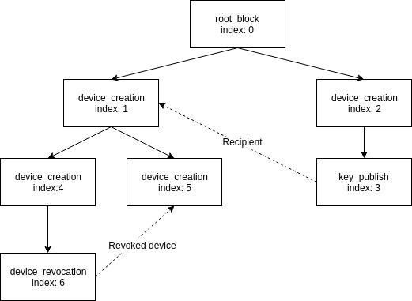

# Trustchain design

[Device Encryption Key Pair]: concepts.md#device-keys "Unique identifier of a user"
[Device ID]: concepts.md#device-id "Unique identifier of a device belonging to a user"
[Device Signature Key Pair]: concepts.md#device-keys "Used when the user signs a block"
[Group Encryption Key Pair]: concepts.md#user-group-keys "Used when sharing data securely within a group"
[Group Signature Key Pair]: concepts.md#user-group-keys "Used when the user modifies a group"
[Local Encrypted Storage]: concepts.md#device-id "A place where key materials are stored, encrypted at rest while the Tanker session is closed"
[Local Clear Storage]: concepts.md#device-id "A place where key materials are stored after they are decrypted while the Tanker session is open"
[Resource Encryption Key]: concepts.md#resource-keys "A symmetric key that can be exchanged securely across users"
[Shared Encrypted Key]: concepts.md#resource-keys "The result of encrypting a Resource Encryption Key for a recipient"
[Trustchain Signature Key Pair]: concepts.md#trustchain-keys "Root of the Trustchain - used to sign user additions"
[User Encryption Key Pair]: concepts.md#user-keys "Used for sharing encrypted keys across users"
[User ID]: concepts.md#user-id "Unique identifier of a user"
[Unlock Key]: concepts.md#unlock-key "An opaque token that allows creating new devices"
[User Secret]: concepts.md#user-secret "A secret generated and stored on the application server that protects the local encrypted storage"
[Secret Permanent Identity]: concepts.md#secret-permanent-identity "An opaque string containing private data about user's identity"
[Public Permanent Identity]: concepts.md#public-permanent-identify "Generated from a Secret Permanent Identity - essentialy equivalent to a user ID"
[Secret Provisional Identity]: concepts.md#secret-provisional-identity "Same as Secret Permanent Identity, but for a user not registered on the Trustchain yet"
[Public Provisional Identity]: concepts.md#public-provisional-identity "Same as Public Permanent Identity, but for a user not registered on the Trustchain yet"

*Trustchains* are the backbone of the *Tanker* architecture. This document is a deep dive into their design and their functions.

## Key exchanges

The *Tanker SDK* provides tools to encrypt, decrypt and share *resources* between *users*. It does so using state-of-the-art cryptographic algorithms like elliptic-curve cryptography (ECDH, EdDSA) and stream ciphers (xchacha20-Poly1305) to encrypt those *resources* and share encryption keys between *users*.

When a user intents to share a resource with another user or group of users, the *Tanker SDK* encrypts the *resource* with the symmetric [Resource Encryption Key] it generates; this [Resource Encryption Key] is then encrypted asymmetrically for the listed recipients, using their public keys. The challenge in this scheme is being sure that the [Resource Encryption Key] is shared with the right *user*, without forcing *users* to physically exchange their public keys.

The basic role of a *Trustchain* is to provide public key distribution between *users* without being able to tamper with anything or access any private data.

## Users and devices

Devices are the basic entities we considered when designing the *Trustchain*. A *device* is an entity owned by a *user*. It stores a [Device Signature Key Pair] and a [Device Encryption Key Pair]. In practice, *devices* can be *users*' web browsers, mobile phones, desktop applications, etc.

At a basic level, *devices* can perform three types of actions:

- validate the creation of a new *device*
- revoke another *device* owned by the same *user*
- share a [Resource Encryption Key] with another *device*

## Blocks

Blocks are the constitutive elements of a *Trustchain*, representing the actions taken by *devices*.

Each action corresponds to one or more block natures, which essentially represent different versions of the same action.

The main actions for a block are:

* *device* creation blocks
* *device* revocation blocks
* key publish blocks

Blocks also contain a serialized payload, which contains different information depending on the nature of the block. Typical contents of a block payload are public keys, encrypted private or symmetric keys, and any data necessary to prove the block's validity.

The payload of a key publish block &mdash; the block that shares a [Resource Encryption Key] between different *devices* &mdash; contains the recipient *device*'s ID and the [Resource Encryption Key] encrypted with its public [Device Encryption Key Pair].

The payload of a *device* creation block contains the public [Device Encryption Key Pair] and [Device Signature Key Pair] of the newly created *device*, plus an ephemeral key pair and an [extra signature](#Device creation and signature delegation).

Blocks also have an index, which corresponds to the order in which they are added to the *Trustchain*.

Finally, blocks are signed by their author. For key publishes and *device* revocations, this author is the *device* on which the *user* took the action. For *device* creations, the author is a delegation signed by a valid authority. We'll discuss this in the next section.

This creates an oriented rooted tree structure:

This tree structure can be read in the order of indexes to reconstruct the state of each *user*'s *devices*, and verify that every action taken was legitimate at the time.

## Device creation and signature delegation

We mentioned earlier that the author of a *device* creation block is a delegation signed by a valid authority.

A valid authority can be either the [Trustchain Signature Key Pair] owner (i.e. the *application server*) or a valid *device* owned by the same *user*. The future *device* obtains an ephemeral signature key pair from the authority, signed together with the *user*'s ID by the authority's private signature key. This is called a delegation signature and it acts as a proof that the authority verified the identity of the *user* and authorized them to create a new *device*.

A new block is then created, containing the ephemeral public signature key, the delegation signature and the new *device*'s public keys. The block is signed by the new *device* using the private ephemeral signature key, linking it to the authority.

## The root block

The root block represents the creation of the *Trustchain*. It is not created by *Tanker*, but by the *customer*, in their dashboard. When creating a new *Trustchain*, a new signature key pair is generated on their *device*. This key pair will be the [Trustchain Signature Key Pair]. The public [Trustchain Signature Key Pair] is then written in the root block, which is sent to the *Trustchain* server.

The private [Trustchain Signature Key Pair] is held only by the *Trustchain*'s creator. It represents the *customer* in the *Trustchain* structure and is the authority that signs the first *device* creation block of each *user*.

This allows the *customer* to have control over who can create new *users* in their *Trustchain*.

More importantly, it prevents *Tanker* or anyone who has control over the *Trustchain* distribution or storage to replace or modify any block. This also means that once a *user* creates their first *device*, no one but them can use their *user* ID in the *Trustchain*.

## Blocks distribution and verification

The *Trustchain* server distributes blocks to the different *users*. As a *Trustchain* can consist of millions of blocks, *Tanker* does not distribute every block to every *user*.

Instead, *Tanker* distributes blocks that are useful to each *user*. For example, a key publish block targeted at some other *user* never contains interesting information for anyone else, so *Tanker* only distributes key publish blocks to their respective recipients. *Devices* owned by other *users* are only useful when they signed other relevant blocks.

In our example above (Figure 3.1), the *device* created at index 1 would receive blocks 0 through 6, while the *device* created at index 2 would only need blocks 0 and 2.

When received by a *device*, blocks are verified, and the actions they represent are applied on the local cache representing the current state of the *Trustchain*.

## Trustchain properties

### Publicly verifiable

Any *Trustchain* is publicly verifiable given the public [Trustchain Signature Key Pair]. Every block contains sufficient information to verify the validity of the operation it represents.

### Non-repudiation

Once a block is published in the *Trustchain*, it is immediately verified and distributed to the different participants involved in the operation. The blocks are signed by their author, which makes them non-repudiable.

The author also stores the block they just emitted, preventing the *Trustchain* distribution system from withholding blocks.

### Trust on first use

When first receiving a *device* creation block for a *user*, the recipient needs to trust that the block relates to the correct *user*. The block and the information it contains &mdash; notably the new *device*'s [Device Encryption Key Pair] and [Device Signature Key Pair] &mdash; are then stored locally, preventing the need to ask this *device*'s public key again.

It is to be noted that because of the signature delegation scheme, the entity that needs to be trusted upon receiving blocks for a new *user* is **not** the *Trustchain* distribution system, but the private [Trustchain Signature Key Pair] holder (i.e. the *application server*).

### Forward secrecy

Forward secrecy is, despite being an interesting property, **not **implemented in the *Tanker SDK*. The reason is that the *Tanker SDK* is not targeted solely at encrypting ephemeral message exchanges, but also persistent data. We want *users* to be able to decrypt anything at any time with any of their *devices*, which means that we cannot use a forward secure scheme.

We consider implementing an optional forward secure scheme tailored for messaging in a future version of the *Tanker SDK*.

## Separation of trust

The *Tanker SDK* is based on the separation of trust. Any *user* needs to trust:

- the *application* to store and distribute encrypted data
- *Tanker* to distribute blocks
- *Tanker* and the *application* not to collude

A collusion between *Tanker* and the *application* could result in a split view attack, in which an alternate, seemingly valid version of the *Trustchain* is strategically distributed to *users* in order to trick them into sharing data with the wrong entity.

We plan on implementing a gossiping scheme in future versions of the SDK, which would prevent split view attacks.

